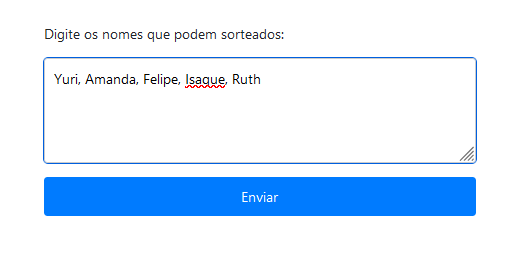
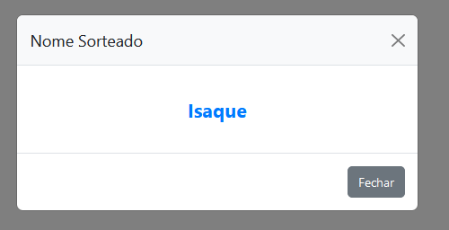

# Sistema de Sorteio 🚀

Este programa de teste foi elaborado para simular sorteio de nomes.

## ➡️ Funcionalidades do Código

1. **Informa os nomes** 
2. **Apresentar o nome sorteado** 

## ➡️ Instalação 

1. Instale o programa dentro da pasta `/var/www/html` ou analise o diretório onde o PHP está instalado para renderizar.
2. Acesse o diretório do programa via web e execute.

