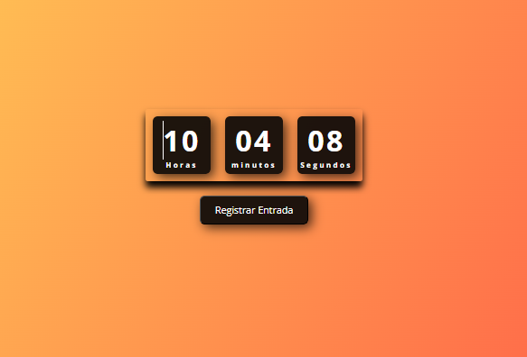
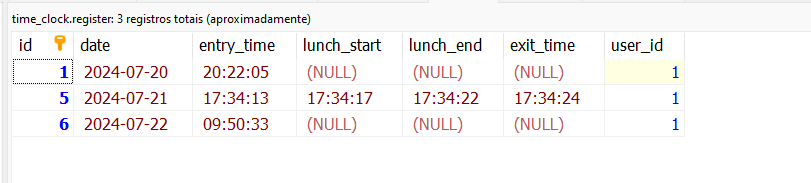

# Sistema de Ponto 🚀

Este programa de teste foi elaborado para simular o registro de um relógio de ponto.

## ➡️ Funcionalidades do Código

1. **Registrar entrada:** 
2. **Registrar almoço:** 
3. **Registrar volta do almoço:** 
4. **Registrar saída** 

## ➡️ Instalação 

1. Instale o programa dentro da pasta `/var/www/html` ou analise o diretório onde o PHP está instalado para renderizar.
2. Acesse o diretório do programa via web e execute.

